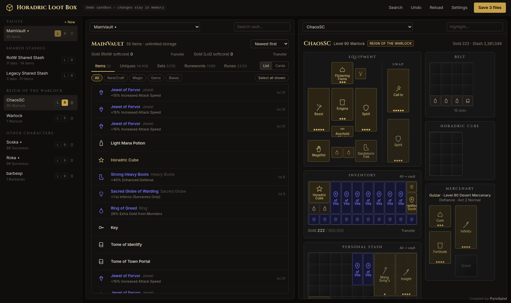
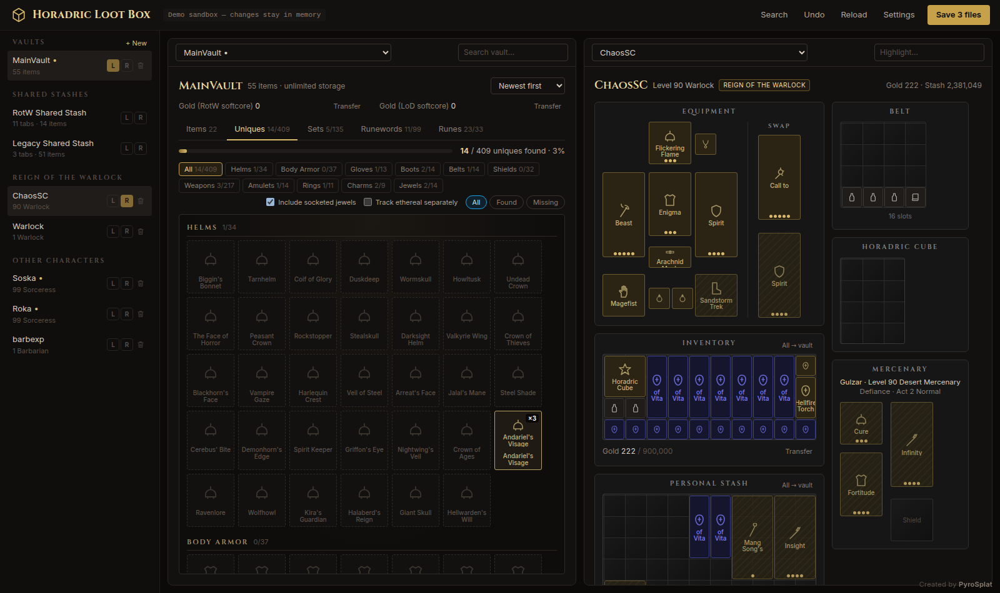
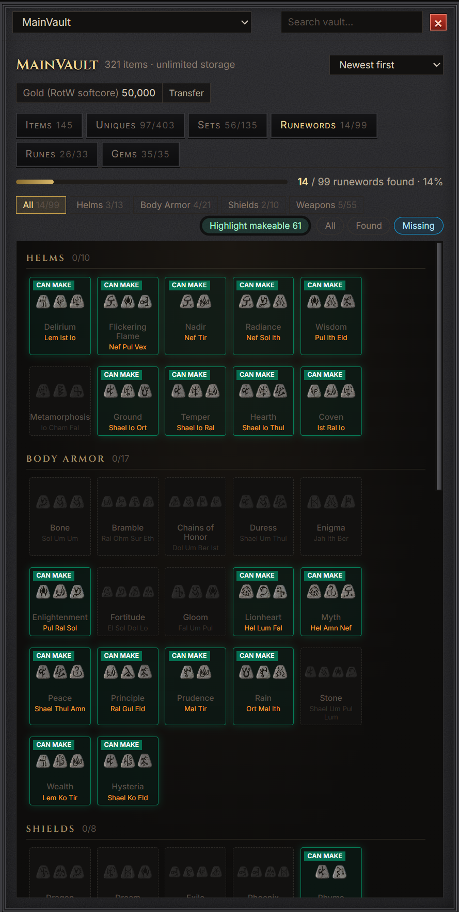
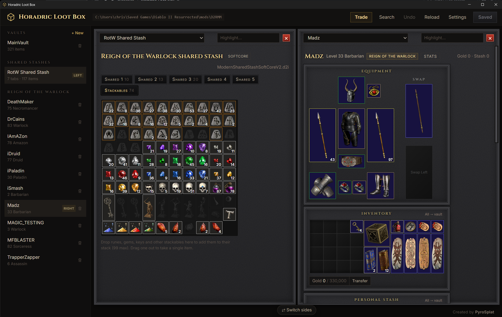

# Horadric Loot Box

A muling and holy-grail tool for **Diablo II: Resurrected: Reign of the Warlock**, with Warlock support. Created by **PyroSplat**.



## Features

- **Two-pane muling:** drag characters, shared stashes or vaults from the sidebar onto either side, then drag items between them.
- **Equip from anywhere:** onto a character, weapon swap, mercenary or belt.
- **Unlimited vaults** with search, quality and item-type filters, and sorting.
- **Item stats and roll ranges:** hover anything in the grail tabs, found or not, to see its stats and ranges; found items show where your roll lands (★ = perfect).
- **Holy grail tabs** for uniques, sets, runewords, runes and gems. They count your whole account, match the game's Chronicle totals, and highlight runewords you can make.
- **Stackables and gold:** a Stackables tab laid out like the game's, and gold transfers between characters, stashes and vaults.
- **Game-style display:** character screen layout, real item tooltips, and item art from your own game files.
- **Automatic updates** from GitHub releases (asks before installing).
- **Safe saving:** backups before every change, each save checked before it's written, no saving while the game runs, and hardcore/softcore and editions never mix.

| Uniques | Runewords | Stackables |
| --- | --- | --- |
|  |  |  |

## Getting started

1. Close Diablo II: Resurrected.
2. Open Horadric Loot Box. It finds your save folder, or you can choose it. It reopens the same folder next time.
3. Drag a character, stash or vault from the sidebar onto the left or right side.
4. Move items, then click **Save**.

**Game art (optional):** extract the game's `data` folder with [CascView](http://www.zezula.net/en/casc/main.html). Then set its location in **Settings → Items → Game art**. Without it, items show as tiles.

**Saves:** `%USERPROFILE%\Saved Games\Diablo II Resurrected` on Windows, or the same path inside your Proton/Wine prefix on Linux.<br>
**Vaults** are kept in a `HoradricLootBox-Vaults` folder inside your save folder, so backing up your saves backs up your vaults too. Vaults from older versions are copied there on first launch.<br>
**Backups** made before each save (the last 10 copies of each file) go in `%APPDATA%\com.horadriclootbox.app\backups` on Windows, or `~/.local/share/com.horadriclootbox.app/backups` on Linux.

## Shortcuts

| Keys | Action |
| --- | --- |
| Ctrl + S / Z / F | Save / Undo / Search |
| Ctrl + click, drag a box | Select several items |
| Shift + drag or double-click | Move 3 stackables at once |
| Right-click / Delete | Delete (asks first; takes one off a stack) |
| Ctrl + / − / 0 | Interface size |

## Limits

- Items on a corpse can't be moved until the body is picked up.
- Supports D2R saves v97–v105. Original 1.14 saves and modded games aren't supported.

## Development

```bash
npm install
npm test               # tests against real saves
npm run dev            # browser version with a demo
npm run desktop:dev    # desktop app (Tauri)
npm run desktop:build  # installers
```

Desktop builds need a C/C++ compiler: the Visual Studio Build Tools on Windows, or g++/clang elsewhere. Linux builds also need `libwebkit2gtk-4.1-dev libgtk-3-dev librsvg2-dev patchelf`. Pushing a `v*` tag builds signed Windows and Linux installers as a draft GitHub release; see [RELEASING.md](RELEASING.md). The app updates itself from published releases.

For a new game patch, replace the tables in `vendor/d2r-3.3/`, then run `npm run gamedata && npm test`.

## Credits

- [CascLib](https://github.com/ladislav-zezula/CascLib) (MIT).
- Save-format research: [D2SSharp](https://github.com/ResurrectedTrader/D2SSharp), [halbu](https://github.com/feored/halbu), [d2s](https://github.com/dschu012/d2s), [d07riv](https://github.com/d07RiV/d07riv.github.io) and [GoMule](https://gomule.sourceforge.io/). Test saves come from D2SSharp and halbu.
- Game tables (© Blizzard) via [D2R-Excel](https://github.com/pinkufairy/D2R-Excel) and [d2data](https://github.com/blizzhackers/d2data). They aren't covered by this project's license; see [NOTICE](vendor/d2r-3.3/NOTICE.md).

Diablo® II: Resurrected™ is a trademark of Blizzard Entertainment, Inc. This project isn't affiliated with Blizzard. Back up your saves.
