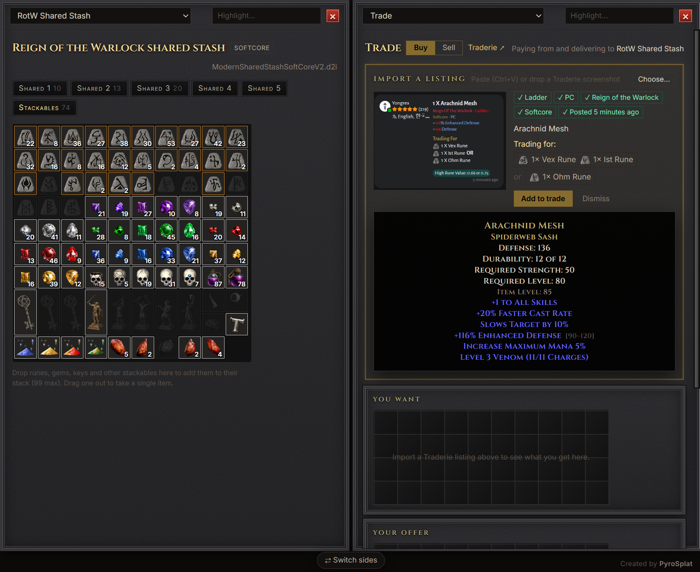

# Horadric Loot Box

A muling and holy-grail tool for **Diablo II: Resurrected: Reign of the Warlock**, with Warlock support. Created by **PyroSplat**.


## Features

- **Two-pane muling:** drag characters, shared stashes or vaults onto either side, then drag items between them.
- **Equip from anywhere:** onto a character, weapon swap, mercenary or belt, with real item tooltips.
- **Unlimited vaults** with search, filters and sorting.
- **Holy grail tabs** for uniques, sets, runewords, runes and gems, counted across your whole account (matches the game's Chronicle).
- **Stats and roll ranges** on every item, found or not (★ = perfect roll).
- **Stackables and gold** moved between characters, stashes and vaults.
- **Character screen** with attributes, resistances by difficulty, attack rating and damage, and cast, hit recovery, block and attack speed breakpoints that follow your gear.
- **Offline trading** from Traderie screenshots (see below).
- **Safe saving:** a backup before every save, each save checked before it's written, no saving while the game runs, and Softcore/Hardcore never mix.
- **Automatic updates** from GitHub releases.

| Uniques | Runewords | Stackables |
| --- | --- | --- |
|  |  |  |

## Offline trading

Trade in single player for items listed on Traderie, at the listing's price. Turn it on in **Settings → Trade**, then click **Trade**.

[](docs/videos/trade.mp4)

- **Buy:** paste (Ctrl+V) or drop a Traderie listing ("Trading For"), drag the runes, gems, keys or items it asks for into **Your offer**, then **Accept trade**.
- **Sell:** switch to **Sell**, import a buyer's listing ("I Give" / "Offering"), drag in what they want, pick what you get, then **Sell**.
- What you get lands in **Received**; drag it into a stash, character or vault and save.
- **History** lists what you got and paid for each saved trade.
- Listings must be PC, Ladder, Reign of the Warlock, posted in the last 3 days, and match your Softcore/Hardcore file. Screenshots are read on your computer; nothing is uploaded.

Works with uniques, set items (and full sets), runewords, magic, rare and crafted items, bases, runes, gems, keys and uber parts. Rolls are checked against the item's real range; rolls a listing doesn't show are random when buying and don't matter when selling. Magic, rare and crafted items can be bought but not sold yet.

**In your browser:** [Horadric Trading Post](https://pyrosplat.github.io/Horadric-Loot-Box/) is the Trade panel as a web page — nothing to install. Drop in your shared stash (`.d2i`), a character (`.d2s`) or your whole save folder, trade, then save. Chrome and Edge write straight back to the file; other browsers download it for you to put back. Your saves never leave your computer. Close the game before saving.

## Getting started

1. Close Diablo II: Resurrected.
2. Open Horadric Loot Box. It finds your save folder, or you can choose it. It reopens the same folder next time.
3. Drag a character, stash or vault from the sidebar onto the left or right side.
4. Move items, then click **Save**.

**Game art (optional):** items show as tiles. To see item pictures, set your D2R install folder in **Settings → Items** (the web page needs the game's `data` folder unpacked with [CascView](http://www.zezula.net/en/casc/main.html)). Art is read from your own files; nothing is shipped or uploaded.

**Saves:** `%USERPROFILE%\Saved Games\Diablo II Resurrected` on Windows, or the same path inside your Proton/Wine prefix on Linux.<br>
**Vaults** are kept in a `HoradricLootBox-Vaults` folder inside your save folder, so backing up your saves backs up your vaults too. Vaults from older versions are copied there on first launch.<br>
**Backups** made before each save (the last 10 copies of each file) go in `%APPDATA%\com.horadriclootbox.app\backups` on Windows, or `~/.local/share/com.horadriclootbox.app/backups` on Linux.

## Shortcuts

| Keys | Action |
| --- | --- |
| Ctrl + S / Z / F | Save / Undo / Search |
| Ctrl + click, drag a box | Select several items |
| Shift + drag or double-click | Move 3 stackables at once |
| Right-click / Delete | Delete (asks first; takes one off a stack) |
| Ctrl + / − / 0 | Interface size |

## Limits

- Items on a corpse can't be moved until the body is picked up.
- Supports D2R saves v97–v105. Original 1.14 saves and modded games aren't supported.

## Development

```bash
npm install
npm test               # tests against real saves
npm run dev            # browser version with a demo
npm run desktop:dev    # desktop app (Tauri)
npm run desktop:build  # installers
```

## Credits

- [CascLib](https://github.com/ladislav-zezula/CascLib) (MIT).
- Save-format research: [D2SSharp](https://github.com/ResurrectedTrader/D2SSharp), [halbu](https://github.com/feored/halbu), [d2s](https://github.com/dschu012/d2s), [d07riv](https://github.com/d07RiV/d07riv.github.io) and [GoMule](https://gomule.sourceforge.io/). Test saves come from D2SSharp and halbu.
- Attack speed breakpoints: the method and animation data come from [Warren1001's IAS Calculator](https://warren1001.github.io/IAS_Calculator/) ([source](https://github.com/Warren1001/IAS_Calculator)), which credits RuffnecKk (D2RLoader) for the animation dump, ChthonVII, ubeogesh, the Amazon Basin forum and Phrozen Keep. The tables are checked against it in `tests/ias.test.ts`.
- Game tables (© Blizzard) via [D2R-Excel](https://github.com/pinkufairy/D2R-Excel) and [d2data](https://github.com/blizzhackers/d2data). They aren't covered by this project's license; see [NOTICE](vendor/d2r-3.3/NOTICE.md).

Diablo® II: Resurrected™ is a trademark of Blizzard Entertainment, Inc. This project isn't affiliated with Blizzard. Back up your saves.
