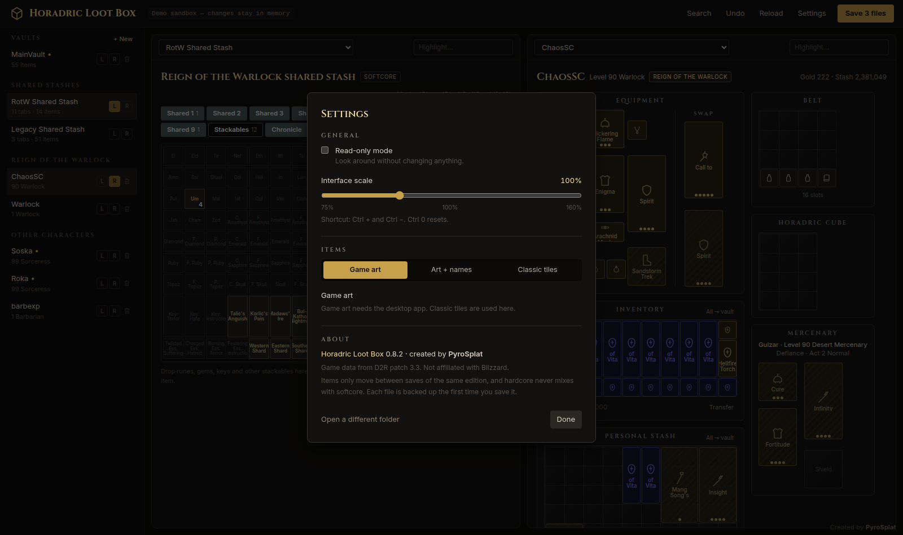
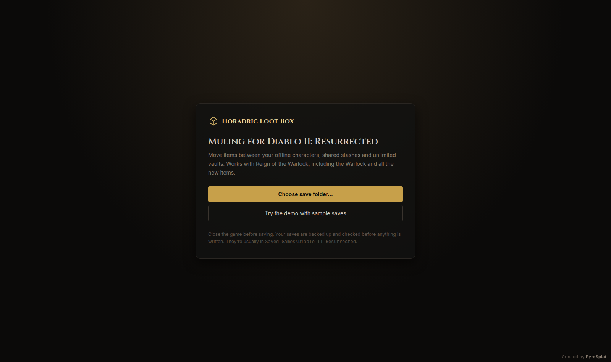

# Horadric Loot Box

**A muling and collection tool for Diablo II: Resurrected: Reign of the Warlock.**

Move items between your offline characters, shared stashes and unlimited vaults, and track your holy grail. It works with the Warlock and all the new Reign of the Warlock items.

Created by **PyroSplat**.

<!-- Screenshots: replace these with your own (game art looks best). Files live in docs/screenshots/. -->


---

## Features

### Move items anywhere
- **Two panes side by side.** Drag any character, shared stash or vault from the sidebar onto either side to open it there. Drag items across, or double-click to send one over.
- **Equip from anywhere.** Drag gear straight onto a character, their weapon swap, their mercenary or their potion belt.
- **Move lots at once.** Ctrl+click items, or drag a box around them, then move the whole group.
- **Undo everything** with Ctrl+Z until you save.

### Unlimited vaults
- Store as many items as you like, outside the game.
- Search, filter by quality or item type (circlets, Barbarian helms, Paladin shields, grimoires, Amazon bows, claws, grand charms, potions…), and sort by name, quality, date or level (lowest or highest first), as a list or as compact cards.
- Keep gold in a vault and move it back when you need it. **Transfer** offers just the nearby places: the other side, this character's other gold spot, and your vaults.


### Holy grail tracking
- **Uniques, Sets, Runewords and Runes tabs** show every item in the game, with what you've found lit up and what's missing dimmed. The totals match the game's Chronicle.
- **Counts your whole account.** Items on characters and in stashes count too, shown faded so you know they're not in the vault.
- **Highlight makeable** lights up runewords you already have the runes for: missing ones glow green, and ones you have already made get a green ring.
- **Runes in items** (runewords and socketed gear) can count toward the Runes tab, with a "N in items" note on each rune.
- **Ethereal uniques** can be tracked separately.


### Looks like the game
- The character screen, belt, cube, mercenary and Stackables tab are laid out like they are in game.
- Item pictures come from your own game files (see [Game art](#game-art)).
- Real tooltips, built from the game's own data.
- Your mercenary's name, level and type are shown with their gear.

### Keeps your saves safe
- Every file is backed up before it's changed.
- Every save is checked before it's written. If anything looks wrong, nothing is written.
- Saving is blocked while the game is running.
- Hardcore and softcore never mix, and items only move between saves of the same edition.
- **Read-only mode** lets you look around without changing anything.



---

## Getting started

1. **Close Diablo II: Resurrected.**
2. **Open Horadric Loot Box.** It finds your save folder automatically, or you can pick it yourself.
3. **Open a character, stash or vault** by dragging it from the sidebar onto the left or right side (or just click it).
4. **Move items around**, then click **Save**.



### Where your saves are

| Platform | Folder |
| --- | --- |
| Windows | `%USERPROFILE%\Saved Games\Diablo II Resurrected` |
| Steam Deck / Linux (Proton) | `~/.local/share/Steam/steamapps/compatdata/<id>/pfx/drive_c/users/steamuser/Saved Games/Diablo II Resurrected` |
| Lutris / Heroic / Bottles / Wine | `<prefix>/drive_c/users/<user>/Saved Games/Diablo II Resurrected` |

Vaults and backups are kept in `%APPDATA%\com.horadriclootbox.app\` on Windows, or `~/.local/share/com.horadriclootbox.app/` on Linux.

### Game art

To show real item pictures you need **unpacked game files**:

1. Extract the game's `data` folder with [CascView](http://www.zezula.net/en/casc/main.html) or [D2RMM](https://github.com/olegbl/d2rmm).
2. In **Settings → Items → Game art**, type or paste the folder's location (it can be on any drive) and click **Use**, or click **Browse…** to find it.

Nothing from the game is copied or shared. Without game art, items are shown as classic tiles.

### Shortcuts

| Keys | Action |
| --- | --- |
| Ctrl + S | Save |
| Ctrl + Z | Undo |
| Ctrl + F | Search everything |
| Ctrl + click / drag a box | Select several items |
| Shift + drag / Shift + double-click | Move 3 runes, gems, keys or other stackables at once |
| Delete / right-click | Delete items (asks first). On a stack, only one is deleted |
| Ctrl + / Ctrl − / Ctrl 0 | Make the interface bigger, smaller or reset it |
| Esc | Clear selection |

### Good to know
- Items on a corpse are shown but can't be moved until you pick up the body.
- Works with D2R saves from any patch (save versions 97–105). Original Diablo II 1.14 saves and heavily modded games aren't supported.
- Upgrading from **Horadric Vault**? Your vaults, backups and settings are copied over on first launch. Old vault files still open.

---

## For developers

```bash
npm install
npm test               # save-format and move tests against real saves
npm run dev            # browser version with a demo at http://localhost:5173
npm run desktop:dev    # desktop app (Tauri)
npm run desktop:build  # installers in src-tauri/target/release/bundle
```

Desktop builds need a C/C++ compiler for CascLib: the Visual Studio Build Tools on Windows, or g++/clang elsewhere. On Linux you'll also need `libwebkit2gtk-4.1-dev libgtk-3-dev librsvg2-dev patchelf`. Keep the project out of OneDrive folders, because the build folder gets large and syncing locks its files. The GitHub Actions workflow builds Windows and Linux installers, and pushing a `v*` tag makes a draft release.

<details>
<summary>Project layout</summary>

```
src/core/        save-file library (no UI)
  item.ts          item parser (save versions 97–105)
  d2s.ts / d2i.ts  characters and shared stashes
  layout.ts        grids and placement rules
  describe.ts      item names and tooltips from the game tables
  verify.ts        re-reads every file before it's written
  vault.ts         vault file format (.hlb.json)
  collection.ts    grail catalogs and counts
  merc.ts          mercenary type and level
src/state/       app state: moves, undo, saving
src/ui/          React + Tailwind interface
src/platform/    desktop, browser and demo adapters
src/art/         matches items to the game's item pictures
src-tauri/       Rust side: finding saves, safe writes, backups, reading game art
scripts/build-gamedata.mjs   builds src/core/data/gamedata.json from vendor/d2r-3.3
```

For a new game patch, put the new `.txt` tables and `allstrings-eng.json` in `vendor/`, then run `npm run gamedata` and `npm test`.

</details>

## Credits

- [CascLib](https://github.com/ladislav-zezula/CascLib) by Ladislav Zezula (MIT), and sprite notes from [D2RMM](https://github.com/olegbl/d2rmm) (MIT).
- Save-format research: [D2SSharp](https://github.com/ResurrectedTrader/D2SSharp) (MIT), [halbu](https://github.com/feored/halbu) (MIT), [d2s](https://github.com/dschu012/d2s), [d07riv's converter](https://github.com/d07RiV/d07riv.github.io), Trevin's 1.09 notes, and the original [GoMule](https://gomule.sourceforge.io/).
- Game tables (item, skill and string data, © Blizzard Entertainment) via [pinkufairy/D2R-Excel](https://github.com/pinkufairy/D2R-Excel) and [blizzhackers/d2data](https://github.com/blizzhackers/d2data). They are not covered by this project's license; see `vendor/d2r-3.3/NOTICE.md`.
- Test saves from D2SSharp and halbu.

Diablo® II: Resurrected™ and Reign of the Warlock are trademarks of Blizzard Entertainment, Inc. This project isn't affiliated with or endorsed by Blizzard. Always back up your saves.
